Este es un set de pinceles para Azpainter2 hecho por mí. De momento, únicamente, incluyo configuraciones básicas y pinceles para Lineart y Sketching.
En el futuro espero extenderlo con pinceles para digital painting, puntas(shapes) y texturas.

También agrego a este repositorio algunos dotfiles y assets estéticos: un tema para el gestor de ventanas (xfwm/xfce), dos esquemas de color para azpainter (mthemeeditor), dos sets de iconos claros para la interfaz del programa y sus fuentes para que puedas personalizarlos por tu cuenta. Estos assets están pensado para mantener la congruencia con temas gtk oscuros basados en Arc theme (Qogir) o Materia theme (Simply Circles).

El es_XX no es completo ni final, necesita -algunas- muchas revisiones puntuales, cambia mucho con respecto al oficial incluyendo los atajos de menú, tengo que desaconsejar su uso, para más información sobre mis objetivo lea el archivo CREDITS adjunto.

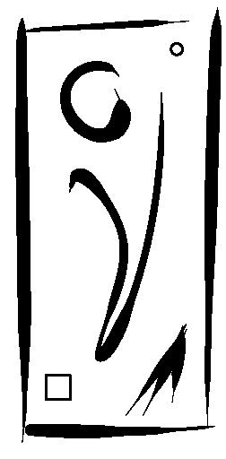 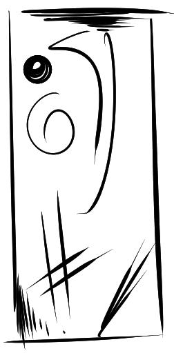 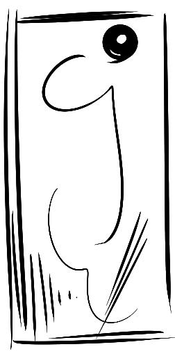 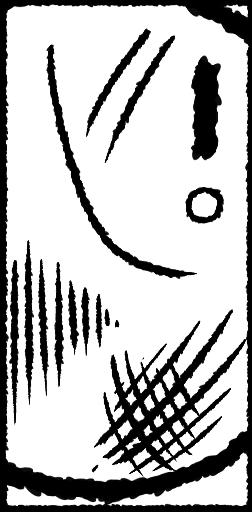 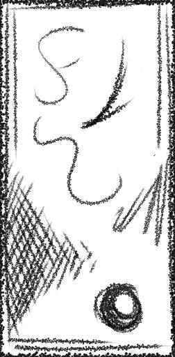 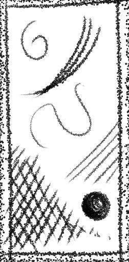 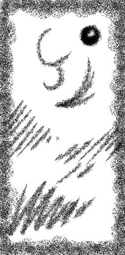 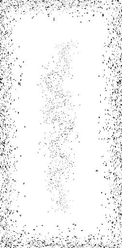 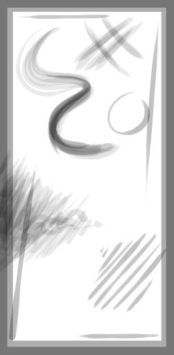 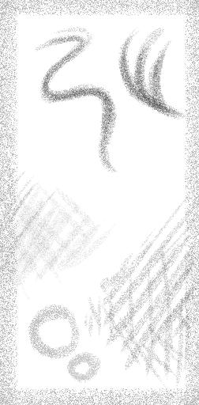 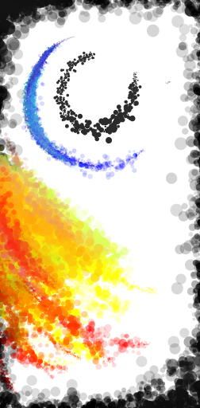

# Instrucciones

## Como agregar cada pincel a Azpainter:

1) Abrir cada archivo debtro de /src/brushes con un editor de texto.

3) Seleccionar todo el código y copiarlo al portapapeles (Ctrl+Insert)

4) Abrir Azpainter y agregar desde portapapeles los nuevos pinceles, haz click derecho sobre el listado de pinceles [aquí](https://github.com/Symbian9/azpainter/wiki/Brushes).  
En menú contextual que se abrirá solo elegir la opción 'pegar...'.

Si todo salió bien, el nuevo pincel se habrá agregado al final del listado de pinceles.


## Como agregar los archivos de perzonalización opcionales:

1) Copia main-2.conf y sckey-2.conf.

2) Copia el contenido de las carpetas 'shapes' y 'textures' a la carpeta correspondientes de programa en el directorio de usuario (/home/userdir/.azpainter).
 
**Nota**: 'shapes' hace alusión al contenido de 'brush' y texturas a 'texture'; OJO: tambien puedes configurar main-2.conf 
una ruta personalizada tal como yo [opcional]. 

3) Copia el contenido de 'themes' a tu carpeta de temas (/home/userdir/.themes). [opcional: solo para xfce + wckbuttons pluging]

4) Copia 'es_MX.mtr' [necesita precompilarse] y/o el contenido de 'icons' a la ubicacion correspondiente en el directorio de intalacion (/usr/share/azpainter); OJO: esta es una operacion root, recomiendo hacerla manualmente para evitar accidentes, las rutas de instalación pueden no concordar en tu OS.

5) Personaliza tus .desktop/minetipe files.
---
Mi recomendacion es:

```
/home/userdir/.azpainter/
                        ├── sckey-2.conf
                        ├── main-2.conf
                        ├── themes/ [symbolic]
                        ├── textures/
                        └── shapes/
                                  ├── comunidad
                                  ├── personal
                                  └── textures [symbolic]
/home/userdir/.themes/
                     ├── style 1
                     ├── style 2
                     └── style 3
/usr/share/azpainter/
                    ├── coltype.png
                    ├── 13x13
                    ├── 16x16
                    ├── 20x20
                    ├── 24x24
                    ├── 32x32 [*]
                    ├── 48x48 [*]
                    └── tr/es_LAT.mtr
```

---
### Screenshots

<details>
  <summary>Xfce Dark Theme</summary>


</details>

---

Dudas y preguntas: 
https://kmanalli.deviantart.com


